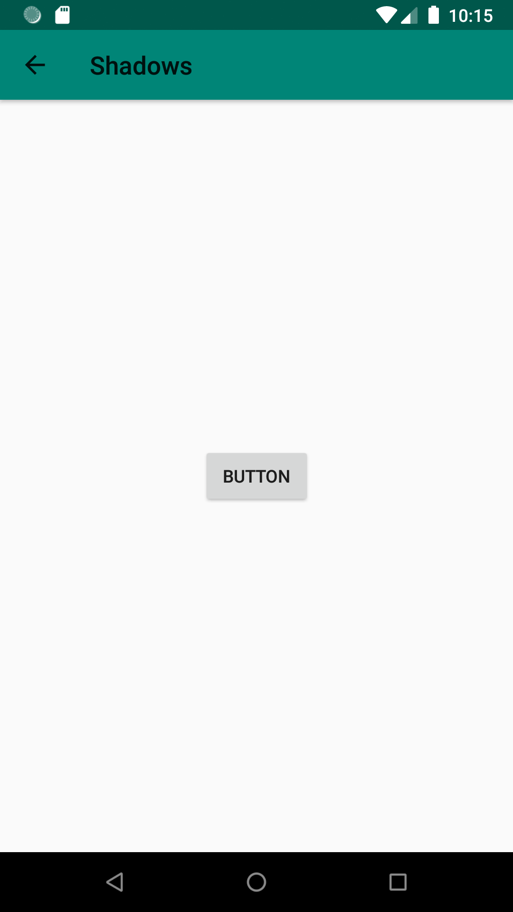
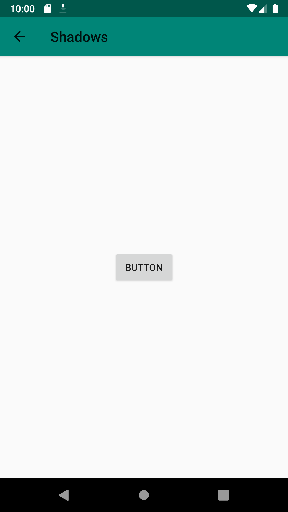
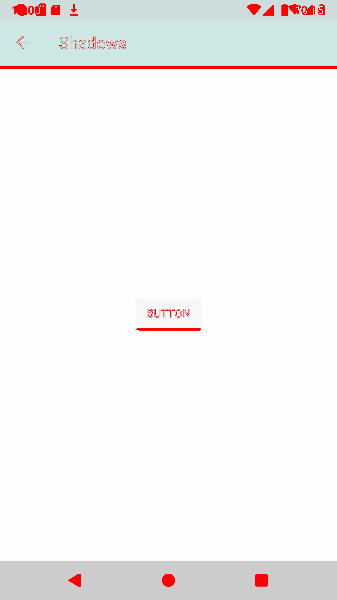

The aim of this porject is to demonstrate the difference in rendering of the shadows between Android versions.

It looks like from Android API 28 the shadows are less intense, sometimes barely visible (see the toolbar shadow in the example below).

The spot shadow alpha and the ambient shadow alpha haven't chaned for between API 27 and API 28 and their values are `0.19` and `0.039` repectively.

```
    <item type="dimen" format="float" name="ambient_shadow_alpha">0.039</item>
    <item type="dimen" format="float" name="spot_shadow_alpha">0.19</item>
```

The new way of rendering the shadows doesn't stick to [the material design guidlines](https://material.io/design/environment/light-shadows.html#shadows) where the shadows are easily visible.

| API 27 | API 28 | Difference |
|---|---|---|
||||

